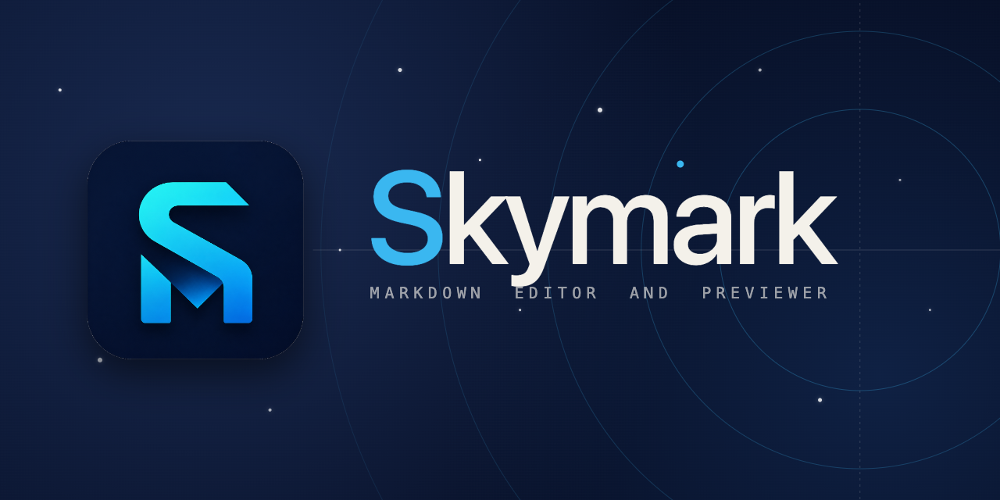

<p align="center">
  
</p>

# Skymark

Skymark is a fast, lightweight Markdown editor built with Rust and Tauri 2. Write in the left pane, see a live HTML preview on the right. Supports CommonMark, GitHub Flavored Markdown, math via KaTeX, Mermaid diagrams, and syntax highlighting in 100+ languages. Features multi-tab editing, a sidebar file tree, draft auto-save, HTML export, and print-to-PDF. Available for macOS (universal), Linux, and Windows with auto-update. Built on CodeMirror 6 with bidirectional editor-preview scroll sync.

---

## Installation

### Download a release (recommended)

Go to the [Releases page](https://github.com/jinzuo/skymark/releases) and download the installer for your platform:

| Platform | File | Notes |
|----------|------|-------|
| macOS (Apple Silicon + Intel) | `Skymark_x.y.z_universal.dmg` | Open and drag to Applications |
| Linux | `skymark_x.y.z_amd64.AppImage` | `chmod +x` then run |
| Windows | `Skymark_x.y.z_x64-setup.exe` | Run the installer |

**macOS:** The app is unsigned. On first launch, right-click → Open, then click Open in the dialog.

**Windows:** SmartScreen may warn about an unknown publisher. Click "More info" → "Run anyway".

**Linux:** The AppImage is self-contained. No install step needed beyond making it executable:
```bash
chmod +x skymark_x.y.z_amd64.AppImage
./skymark_x.y.z_amd64.AppImage
```

### Build from source

See [Build from source](#build-from-source) below.

---

## Usage

### Opening files

- **Single file:** `Cmd/Ctrl + O` opens a file picker. Skymark supports `.md`, `.markdown`, and `.txt` files.
- Files open in new tabs; multiple files can be open at once.

### Editing

The left pane is a full-featured code editor ([CodeMirror 6](https://codemirror.net)) with Markdown syntax highlighting. The preview on the right updates as you type (~50ms debounce).

**Editor-preview sync** — clicking a line in the preview scrolls the editor to the corresponding line, and vice versa. This makes it easy to navigate between source and rendered output.

Supported Markdown:
- **CommonMark + GFM** — tables, strikethrough, task lists (`- [ ]`), fenced code blocks with language tags
- **Math** — inline (`$x^2$`) and display (`$$...$$`) via [KaTeX](https://katex.org)
- **Diagrams** — [Mermaid](https://mermaid.js.org) fenced blocks (` ```mermaid `)
- **Syntax highlighting** in fenced code blocks (100+ languages via [highlight.js](https://highlightjs.org))

### Sidebar

When you open a file, the sidebar shows a lazy-loaded directory tree of the file's parent folder. 
Cross-folder opens switch the sidebar to the new file's folder automatically.

### Saving

- `Cmd/Ctrl + S` — saves the current file. Prompts for a path if the file has never been saved.
- A `●` in the titlebar indicates unsaved changes.
- **Draft auto-save** — Skymark saves a draft every few seconds. If the app crashes, it offers to recover your unsaved work on next launch.

### Exporting

Click the **Export ▾** button in the titlebar:

- **Export as HTML** — saves a standalone `.html` file with CDN-linked CSS for KaTeX and syntax highlighting. Math, diagrams, and code highlighting are baked in — no JavaScript required in the exported file.
- **Print / Save as PDF** — triggers the OS print dialog. The editor and sidebar are hidden; only the document content prints at full width.

### System menu

Skymark augments the native OS menu with File and Edit items:

- **File → New** (`Cmd/Ctrl + N`) — new document
- **File → Open** (`Cmd/Ctrl + O`) — open file
- **File → Close Window** (`Cmd/Ctrl + W`) — close current tab
- **File → Save** (`Cmd/Ctrl + S`) — save file
- **File → Print** (`Cmd/Ctrl + P`) — print / save as PDF
- **Edit → Find** (`Cmd/Ctrl + F`) — find in editor

### Theme

Click the **🌙** button in the titlebar to toggle between light and dark themes.

### Auto-update

Skymark checks for updates 3 seconds after launch. When a new version is available, a banner appears below the titlebar with an **Install & Restart** button. You can also click the **↑** button in the titlebar to check manually.

---

## Keyboard shortcuts

| Shortcut | Action |
|----------|--------|
| `Cmd/Ctrl + O` | Open file |
| `Cmd/Ctrl + S` | Save file |
| `Cmd/Ctrl + N` | New document |
| `Cmd/Ctrl + W` | Close current tab |
| `Cmd/Ctrl + P` | Print / save as PDF |
| `Cmd/Ctrl + \` | Toggle sidebar |
| `Cmd/Ctrl + Z` | Undo |
| `Cmd/Ctrl + Shift + Z` | Redo |
| `Cmd/Ctrl + F` | Find in editor |

---

## Build from source

### Prerequisites

- [Rust](https://rustup.rs) (stable toolchain)
- [Node.js](https://nodejs.org) 20+
- Platform system libraries:
  - **macOS:** Xcode Command Line Tools (`xcode-select --install`)
  - **Linux (Ubuntu/Debian):**
    ```bash
    sudo apt-get install libwebkit2gtk-4.1-dev libgtk-3-dev \
      libayatana-appindicator3-dev librsvg2-dev
    ```
  - **Windows:** [Microsoft C++ Build Tools](https://visualstudio.microsoft.com/visual-cpp-build-tools/) + WebView2 (pre-installed on Windows 10 21H2+)

### Development

```bash
git clone https://github.com/jinzuo/skymark
cd skymark
npm install
npm run tauri:dev
```

The dev server starts Vite with hot-reload and opens the Tauri window. Rust code changes require a restart.

### Production build

```bash
npm run tauri:build
```

Output is in `crates/skymark-app/target/release/bundle/`.

### Run tests

```bash
cargo test          # Rust unit tests
npm run build       # TypeScript type-check + Vite build
```

---

## Architecture Overview

Skymark is split into three layers:

- **`skymark-core`** — pure Rust library. Converts Markdown to sanitized HTML using [pulldown-cmark](https://github.com/raphlinus/pulldown-cmark) and [ammonia](https://github.com/notriddle/ammonia). No Tauri dependency. Injects `data-line` attributes on block elements for editor-preview sync.
- **`skymark-app`** — Tauri 2 backend. Exposes commands for rendering, file I/O, export, and lazy directory listing. Saves files atomically (write-temp-then-rename). Deny-by-default capability model.
- **Frontend** — Vite + TypeScript. CodeMirror 6 editor with format toolbar, preview rendered via `DOMParser` + `replaceChildren` (never `innerHTML`). Editor-preview sync follows cursor/scroll between panes.
